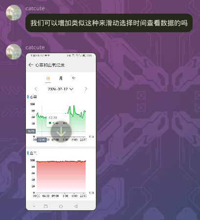

# 贡献者们

感谢每一位愿意使用本软件、指出程序缺陷和提出功能请求的用户，你们的支持是我们更新的最大动力！

## 酥鱼

QQ 1467657629

### 用户友好的药品添加

类型：议题-改进建议

原始：老师，那个药品库添加的时候直接点好像没法选中，只能点手动添加来着 但是手动添加里面又有默认信息

提出于：2026/07/11.01:08

解决于：2026/07/11.09:53

提交：41ac825ff3990c7e7d22e11708bf9bb4bc359cab

## Megumi_Wakamu

BiliBili 629041715

### 上床与下床时间记录

类型：议题-功能请求

原始：可以加个开始睡眠记录和醒来的记录吗 上床准备闭眼的时候记录和醒来睁眼时记录 这样接入原有的睡眠记录功能更方便精准

提出于：2026/07/13.23:46

解决于：2026/07/14.13:29

提交：9df1d72dde19bc0b74cc34a77d1130687beaf5e8

### 自动记录服药

类型：议题-功能请求

原始：以及，能否加一个到了服药时间自动提醒和自动扣药量的功能 加了之后盘点药量也更好算了

提出于：2026/07/14.18:20

解决于：2026/07/18.15:28

提交：77cd5c225ffa658c1da371fd9764267059a73162

## catcute

QQ 1794128700

### 记录时自动填充当前分钟

类型：议题-改进建议

原始：我们可否添加当用户点击记录弹到那个界面的时候，设置的时间会自动获取当前的时间，譬如你9:18想去记录某件事情，你点进去，它上面写的不是9点，而是9:18，这样每次记录事情就不用再点一次来更改分钟了

提出于：2026/07/14.21:19

解决于：2026/07/15.12:22

提交：f53c9cc694f6f61ce46b15ac3a422820c24499cb

### 滚动锁定

类型：议题-功能请求

原始：我们可以增加类似这种来滑动选择时间查看数据的吗

提出于：2026/07/15.19:52

解决于：2026/07/17.19:43

提交：6c495948c7ad2e9e031398f3815a08485b4636fc

## 爱若梦

QQ 2915489357

### 补充的药效计算

类型：议题-功能请求

原始：@所有者-张智杰 可以加一个病龄设定吗？确定何时开始吃药

提出于：2026/07/20.13:25

解决于：2026/07/23.01:27

提交：d041c5d022ab4393cfabc2d879c1629515c1cd8d

## 清平

QQ 2686538853

### 简化模式

类型：议题-功能请求

原始：@所有者-张智杰 upup，我这有个问题，就是可能会有人可能会不记得具体哪个时间点发生情绪波动，有时候会是无意识的，事后才能反应，我自己用ai跑出来的图，只分了早中晚，偶尔加一个凌晨，如果考虑到这一点，加一个粗略记录的模式会不会更有普适性呢（思考

提出于：2026/07/22.07:46

解决于：2026/07/23.01:51

提交：2e94a08ae21529ef51506e4938d97661962750a2
